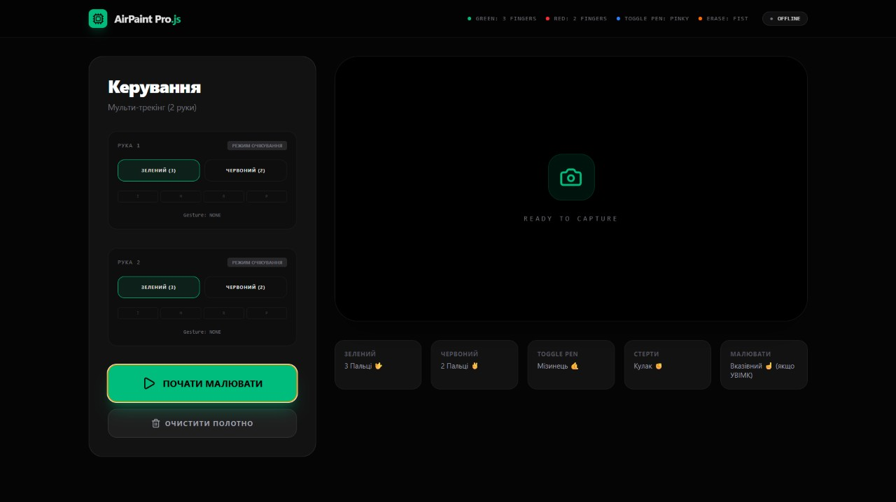

# airpaint-pro
Air Canvas Desktop 🎨✨ — A professional real-time hand tracking and drawing application for desktop, built with React, Electron and MediaPipe.
# 🎨 Air Canvas Desktop


<div align="center">
  
  <p><i>Приклад роботи застосунку: малювання в реальному часі за допомогою жестів рук.</i></p>
</div>
  <p><i>Приклад роботи застосунку: малювання в реальному часі за допомогою жестів рук.</i></p>
</div>

**Air Canvas Desktop** — це професійний десктопний застосунок, який дозволяє малювати в повітрі за допомогою жестів рук у реальному часі. Проєкт поєднує в собі потужність комп'ютерного зору (MediaPipe) для відстеження рухів, сучасний інтерфейс на React та десктопну архітектуру Electron.

---

## ✨ Ключові можливості

- **✋ Трекінг рук у реальному часі:** Високоточне відстеження рухів за допомогою MediaPipe (фіксація кінчика вказівного пальця).
- **🖌️ Малювання в повітрі (Air Canvas):** Перетворення жестів на цифрові малюнки на екрані.
- **💻 Кросплатформність:** Десктопний застосунок, упакований за допомогою Electron з безпечним управлінням дозволами на камеру.
- **⚡ Сучасний UI:** Побудований на React + Vite з використанням TailwindCSS та анімацій Framer Motion.

## 🛠 Технологічний стек

* **Frontend:** React 19, Vite, TailwindCSS, Lucide React, Motion.
* **Desktop:** Electron.
* **Computer Vision (Python & JS):** OpenCV, MediaPipe Hands.
* **Database:** Better-SQLite3.

## 🚀 Встановлення та запуск

Проєкт складається з Node.js (десктопний застосунок) та Python (модуль трекінгу) частин. 

### Попередні вимоги
- [Node.js](https://nodejs.org/) (рекомендовано v18+)
- [Python](https://www.python.org/) 3.10+
- Вебкамера

### 1. Налаштування Node.js (Electron + React) застосунку

Клонуй репозиторій та встанови залежності:

```bash
git clone [https://github.com/your-username/airpaint-pro.git](https://github.com/your-username/air-canvas-ai.git)
cd airpaint-pro
npm install
